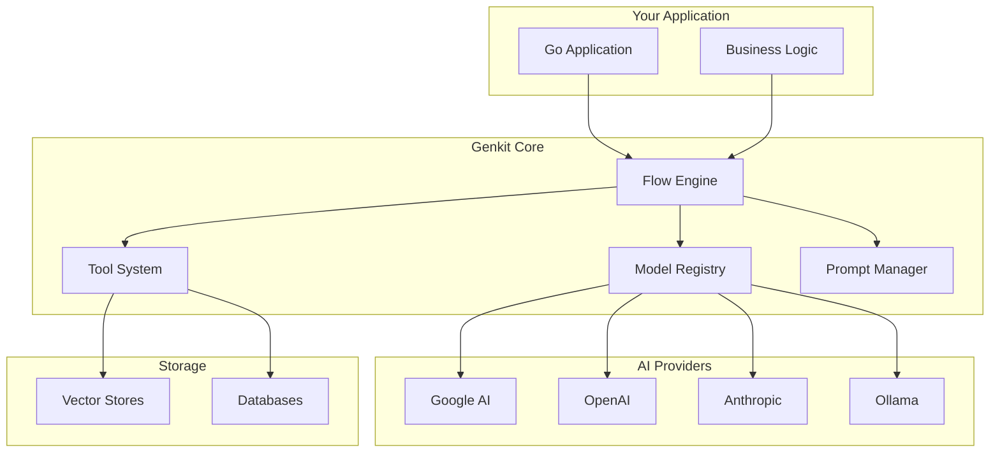
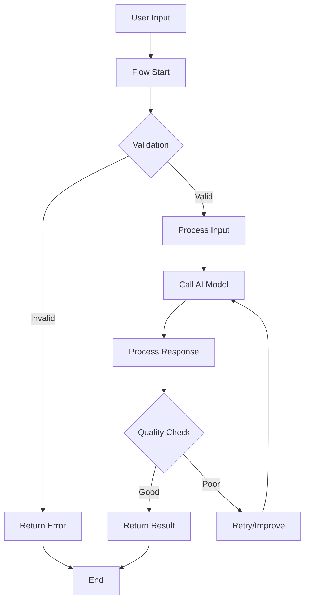
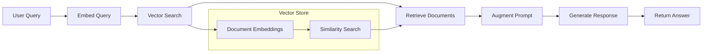
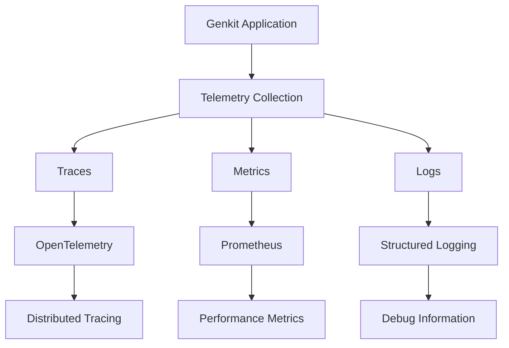

+++
title = "Go Genkit: Building AI-Powered Applications"
description = "A comprehensive guide to Google's Go Genkit framework for developing production-ready AI applications"
outputs = ["Reveal"]
[reveal_hugo]
custom_theme = "reveal-hugo/themes/robot-lung.css"
margin = 0.2
highlight_theme = "color-brewer"
transition = "slide"
transition_speed = "fast"
[reveal_hugo.templates.hotpink]
class = "hotpink"
background = "#FF4081"
+++

# 🚀

# Go Genkit

**Building AI-Powered Applications with Google's Framework**

*Production-ready AI development made simple*

---

## What is Go Genkit?

{}
### Google's Open-Source Framework
Built by the Firebase team for creating AI-powered applications
{}

{}
### Multi-Language Support
- **JavaScript/TypeScript** (Stable)
- **Go** (Beta) ← Today's focus
- **Python** (Alpha)
{}

{}
### Production-Ready Features
Monitoring, evaluation, deployment, and observability built-in
{}

---

## Why Choose Go Genkit?

```mermaid
graph TB
    A[Go Genkit Benefits] --> B[🎯 Type Safety]
    A --> C[⚡ High Performance]
    A --> D[🔄 Concurrency]
    A --> E[☁️ Cloud Native]
    
    B --> B1[Compile-time error detection]
    C --> C1[Efficient memory management]
    D --> D1[Built-in goroutines]
    E --> E1[Easy Kubernetes deployment]
```



---

## Architecture Overview



---

## Getting Started

### Installation

```bash
# Initialize Go module
go mod init my-genkit-app

# Install Genkit
go get github.com/firebase/genkit/go/genkit

# Install AI provider
go get github.com/firebase/genkit/go/plugins/googleai
```

---

### Basic Example

```go
package main

import (
    "context"
    "fmt"
    "log"
    
    "github.com/firebase/genkit/go/ai"
    "github.com/firebase/genkit/go/genkit"
    "github.com/firebase/genkit/go/plugins/googleai"
)

func main() {
    ctx := context.Background()
    
    // Initialize Genkit
    genkit.Init(ctx, nil)
    googleai.Init(ctx, &googleai.Config{
        APIKey: os.Getenv("GOOGLE_AI_API_KEY"),
    })
    
    // Generate text
    result, err := ai.Generate(ctx, &ai.GenerateRequest{
        Model:  googleai.Model("gemini-1.5-flash"),
        Prompt: ai.NewTextPrompt("Explain Go concurrency"),
    })
    
    if err != nil {
        log.Fatal(err)
    }
    
    fmt.Println(result.Text)
}
```

---

## Core Components

### 1. Models

{}
**Unified Interface** for multiple AI providers
{}

```go
// Google AI
googleai.Model("gemini-1.5-flash")

// OpenAI (via plugin)
openai.Model("gpt-4")

// Anthropic (via plugin)  
anthropic.Model("claude-3-sonnet")

// Local models
ollama.Model("llama3")
```

---

### 2. Flows

{}
**Workflows** that orchestrate AI operations
{}

```go
var chatFlow = genkit.DefineFlow(
    "chatFlow",
    func(ctx context.Context, input string) (string, error) {
        // Multi-step AI workflow
        resp, err := ai.Generate(ctx, &ai.GenerateRequest{
            Model: googleai.Model("gemini-1.5-flash"),
            Prompt: ai.NewTextPrompt(input),
        })
        return resp.Text, err
    },
)
```

---

### Flow Architecture



---

### 3. Prompts & Dotprompt

{}
**Template System** for managing prompts
{}

```yaml
# prompts/summarize.prompt
---
model: googleai/gemini-1.5-flash
input:
  schema:
    text: string
    max_length: number
---

Please summarize the following text in {{max_length}} words or less:

{{text}}

Key points to focus on:
- Main ideas
- Important details
- Conclusions
```

---

### Using Dotprompt

```go
// Load and execute prompt
prompt, err := dotprompt.Open("summarize")
if err != nil {
    log.Fatal(err)
}

result, err := prompt.Generate(ctx, map[string]any{
    "text": "Long article text here...",
    "max_length": 100,
})
```

---

### 4. Tools & Function Calling

{}
**Extend AI capabilities** with custom functions
{}

```go
var weatherTool = genkit.DefineTool(
    "get_weather",
    "Get current weather for a location",
    func(ctx context.Context, input struct {
        Location string `json:"location"`
    }) (string, error) {
        // Call weather API
        weather := getWeatherFromAPI(input.Location)
        return fmt.Sprintf("Weather in %s: %s", 
            input.Location, weather), nil
    },
)
```

---

### Tool Integration

```go
resp, err := ai.Generate(ctx, &ai.GenerateRequest{
    Model: googleai.Model("gemini-1.5-flash"),
    Prompt: ai.NewTextPrompt(
        "What's the weather like in San Francisco?"),
    Tools: []*ai.Tool{weatherTool},
})
```

---

## RAG (Retrieval-Augmented Generation)

### Vector Store Integration



---

### RAG Implementation

```go
// Define retriever
var docRetriever = genkit.DefineRetriever(
    "docs",
    func(ctx context.Context, req *ai.RetrieverRequest) (*ai.RetrieverResponse, error) {
        // Vector similarity search
        docs := vectorStore.Search(req.Content, 5)
        
        var parts []*ai.DocumentData
        for _, doc := range docs {
            parts = append(parts, &ai.DocumentData{
                Content: []*ai.Part{ai.NewTextPart(doc.Content)},
            })
        }
        
        return &ai.RetrieverResponse{Documents: parts}, nil
    },
)
```

---

### RAG Flow

```go
var ragFlow = genkit.DefineFlow(
    "ragFlow",
    func(ctx context.Context, query string) (string, error) {
        // Retrieve relevant documents
        docs, err := ai.Retrieve(ctx, &ai.RetrieverRequest{
            Retriever: docRetriever,
            Content:   ai.NewTextPart(query),
        })
        if err != nil {
            return "", err
        }
        
        // Generate response with context
        resp, err := ai.Generate(ctx, &ai.GenerateRequest{
            Model: googleai.Model("gemini-1.5-flash"),
            Prompt: buildRAGPrompt(query, docs.Documents),
        })
        
        return resp.Text, err
    },
)
```

---

## Advanced Features

### Streaming Responses

```go
stream, err := ai.GenerateStream(ctx, &ai.GenerateRequest{
    Model:  googleai.Model("gemini-1.5-flash"),
    Prompt: ai.NewTextPrompt("Write a long story..."),
})

for chunk := range stream {
    if chunk.Error != nil {
        log.Printf("Error: %v", chunk.Error)
        break
    }
    fmt.Print(chunk.Content[0].Text)
}
```

---

### Structured Output

```go
type Recipe struct {
    Name        string   `json:"name"`
    Ingredients []string `json:"ingredients"`
    Steps       []string `json:"steps"`
    PrepTime    int      `json:"prep_time"`
}

var recipe Recipe
err := ai.GenerateInto(ctx, &ai.GenerateRequest{
    Model: googleai.Model("gemini-1.5-flash"),
    Prompt: ai.NewTextPrompt("Create a recipe for chocolate chip cookies"),
    Output: ai.Output{
        Format: ai.OutputFormatJSON,
        Schema: ai.DefineSchema("Recipe", "", recipe),
    },
}, &recipe)
```

---

### Multi-modal Input

```go
imageData, _ := os.ReadFile("image.jpg")

resp, err := ai.Generate(ctx, &ai.GenerateRequest{
    Model: googleai.Model("gemini-1.5-flash"),
    Prompt: ai.NewMultiModalPrompt(
        ai.NewTextPart("What's in this image?"),
        ai.NewMediaPart("image/jpeg", imageData),
    ),
})
```

---

## Evaluation & Testing

### Built-in Evaluation

```go
var evaluator = genkit.DefineEvaluator(
    "helpfulness",
    func(ctx context.Context, input struct {
        Input  string `json:"input"`
        Output string `json:"output"`
    }) (*ai.EvaluationResult, error) {
        // Evaluate response quality
        score := evaluateHelpfulness(input.Input, input.Output)
        
        return &ai.EvaluationResult{
            Score: score,
            Details: map[string]any{
                "reasoning": "Response addresses user query directly",
            },
        }, nil
    },
)
```

---

### Testing Framework

```go
func TestChatFlow(t *testing.T) {
    ctx := context.Background()
    
    testCases := []struct {
        input    string
        expected string
    }{
        {"Hello", "greeting response"},
        {"Help me", "helpful response"},
    }
    
    for _, tc := range testCases {
        result, err := chatFlow.Run(ctx, tc.input)
        assert.NoError(t, err)
        assert.Contains(t, result, tc.expected)
    }
}
```

---

## Deployment Options

### Cloud Run Deployment

```dockerfile
FROM golang:1.21-alpine AS builder
WORKDIR /app
COPY . .
RUN go build -o main .

FROM alpine:latest
RUN apk --no-cache add ca-certificates
WORKDIR /root/
COPY --from=builder /app/main .
CMD ["./main"]
```

---

### Kubernetes Deployment

```yaml
apiVersion: apps/v1
kind: Deployment
metadata:
  name: genkit-app
spec:
  replicas: 3
  selector:
    matchLabels:
      app: genkit-app
  template:
    metadata:
      labels:
        app: genkit-app
    spec:
      containers:
      - name: genkit-app
        image: gcr.io/project/genkit-app:latest
        ports:
        - containerPort: 8080
        env:
        - name: GOOGLE_AI_API_KEY
          valueFrom:
            secretKeyRef:
              name: ai-secrets
              key: google-ai-key
```

---

## Monitoring & Observability

### Built-in Telemetry



---

### Custom Telemetry

```go
import (
    "github.com/firebase/genkit/go/core/tracing"
)

func myFlow(ctx context.Context, input string) (string, error) {
    // Start trace span
    ctx, span := tracing.Start(ctx, "custom-operation")
    defer span.End()
    
    // Add attributes
    span.SetAttributes(
        attribute.String("input.length", fmt.Sprintf("%d", len(input))),
        attribute.String("operation.type", "text-processing"),
    )
    
    // Your logic here
    result, err := processText(input)
    
    if err != nil {
        span.RecordError(err)
        span.SetStatus(codes.Error, err.Error())
    }
    
    return result, err
}
```

---

## Real-World Examples

### 1. Customer Support Bot

```go
var supportBot = genkit.DefineFlow(
    "supportBot",
    func(ctx context.Context, req CustomerQuery) (SupportResponse, error) {
        // Check knowledge base
        docs, _ := ai.Retrieve(ctx, &ai.RetrieverRequest{
            Retriever: kbRetriever,
            Content:   ai.NewTextPart(req.Question),
        })
        
        // Generate response
        resp, err := ai.Generate(ctx, &ai.GenerateRequest{
            Model: googleai.Model("gemini-1.5-flash"),
            Prompt: buildSupportPrompt(req, docs.Documents),
        })
        
        return SupportResponse{
            Answer:     resp.Text,
            Confidence: calculateConfidence(resp),
            Sources:    extractSources(docs.Documents),
        }, err
    },
)
```

---

### 2. Document Analysis Pipeline

```go
var analyzeDocument = genkit.DefineFlow(
    "analyzeDocument",
    func(ctx context.Context, docData []byte) (AnalysisResult, error) {
        // Extract text from document
        text, err := extractText(docData)
        if err != nil {
            return AnalysisResult{}, err
        }
        
        // Analyze content
        analysis, err := ai.Generate(ctx, &ai.GenerateRequest{
            Model: googleai.Model("gemini-1.5-flash"),
            Prompt: ai.NewTextPrompt(fmt.Sprintf(`
                Analyze this document and extract:
                1. Key topics
                2. Sentiment
                3. Important entities
                4. Summary
                
                Document: %s
            `, text)),
            Output: ai.Output{
                Format: ai.OutputFormatJSON,
                Schema: ai.DefineSchema("Analysis", "", AnalysisResult{}),
            },
        })
        
        var result AnalysisResult
        err = json.Unmarshal([]byte(analysis.Text), &result)
        return result, err
    },
)
```

---

### 3. Code Generation Assistant

```go
var codeGenerator = genkit.DefineFlow(
    "generateCode",
    func(ctx context.Context, req CodeRequest) (CodeResponse, error) {
        // Generate initial code
        codeResp, err := ai.Generate(ctx, &ai.GenerateRequest{
            Model: googleai.Model("gemini-1.5-flash"),
            Prompt: ai.NewTextPrompt(fmt.Sprintf(`
                Generate %s code for: %s
                
                Requirements:
                - Include error handling
                - Add comments
                - Follow best practices
                - Include tests
                
                Language: %s
                Description: %s
            `, req.Language, req.Task, req.Language, req.Description)),
        })
        
        // Validate and improve code
        improvedCode, err := improveCode(ctx, codeResp.Text, req.Language)
        
        return CodeResponse{
            Code:        improvedCode,
            Language:    req.Language,
            Explanation: generateExplanation(ctx, improvedCode),
            Tests:       generateTests(ctx, improvedCode, req.Language),
        }, err
    },
)
```

---

## Best Practices

### 1. Error Handling

```go
func robustFlow(ctx context.Context, input string) (string, error) {
    // Implement retry logic
    for attempt := 0; attempt < 3; attempt++ {
        result, err := ai.Generate(ctx, &ai.GenerateRequest{
            Model:  googleai.Model("gemini-1.5-flash"),
            Prompt: ai.NewTextPrompt(input),
        })
        
        if err == nil {
            return result.Text, nil
        }
        
        // Log and retry
        log.Printf("Attempt %d failed: %v", attempt+1, err)
        time.Sleep(time.Duration(attempt+1) * time.Second)
    }
    
    return "", fmt.Errorf("all attempts failed")
}
```

---

### 2. Configuration Management

```go
type Config struct {
    GoogleAIKey    string `env:"GOOGLE_AI_API_KEY"`
    OpenAIKey      string `env:"OPENAI_API_KEY"`
    ModelName      string `env:"MODEL_NAME" envDefault:"gemini-1.5-flash"`
    MaxRetries     int    `env:"MAX_RETRIES" envDefault:"3"`
    Timeout        time.Duration `env:"TIMEOUT" envDefault:"30s"`
    VectorDBURL    string `env:"VECTOR_DB_URL"`
}

func LoadConfig() (*Config, error) {
    cfg := &Config{}
    if err := env.Parse(cfg); err != nil {
        return nil, err
    }
    return cfg, nil
}
```

---

### 3. Testing Strategies

```go
// Mock provider for testing
type MockProvider struct {
    responses map[string]string
}

func (m *MockProvider) Generate(ctx context.Context, req *ai.GenerateRequest) (*ai.GenerateResponse, error) {
    prompt := req.Prompt.String()
    if response, exists := m.responses[prompt]; exists {
        return &ai.GenerateResponse{
            Text: response,
        }, nil
    }
    return nil, errors.New("no mock response")
}

func TestWithMock(t *testing.T) {
    mock := &MockProvider{
        responses: map[string]string{
            "Hello": "Hi there!",
        },
    }
    
    // Use mock in tests
    // ...
}
```

---

### 4. Performance Optimization

{}
**Caching** - Cache frequent requests
{}

{}
**Batching** - Process multiple requests together
{}

{}
**Connection Pooling** - Reuse HTTP connections
{}

{}
**Async Processing** - Use goroutines for parallel operations
{}

---

## Performance Tips

### Concurrent Processing

```go
func processMultipleInputs(ctx context.Context, inputs []string) ([]string, error) {
    results := make([]string, len(inputs))
    errors := make([]error, len(inputs))
    
    var wg sync.WaitGroup
    for i, input := range inputs {
        wg.Add(1)
        go func(idx int, inp string) {
            defer wg.Done()
            
            result, err := ai.Generate(ctx, &ai.GenerateRequest{
                Model:  googleai.Model("gemini-1.5-flash"),
                Prompt: ai.NewTextPrompt(inp),
            })
            
            if err != nil {
                errors[idx] = err
            } else {
                results[idx] = result.Text
            }
        }(i, input)
    }
    
    wg.Wait()
    
    // Handle any errors
    for _, err := range errors {
        if err != nil {
            return nil, err
        }
    }
    
    return results, nil
}
```

---

## Integration Examples

### REST API Server

```go
func main() {
    ctx := context.Background()
    
    // Initialize Genkit
    genkit.Init(ctx, nil)
    googleai.Init(ctx, &googleai.Config{
        APIKey: os.Getenv("GOOGLE_AI_API_KEY"),
    })
    
    // Create HTTP server
    mux := http.NewServeMux()
    
    mux.HandleFunc("/chat", func(w http.ResponseWriter, r *http.Request) {
        var req ChatRequest
        json.NewDecoder(r.Body).Decode(&req)
        
        response, err := chatFlow.Run(r.Context(), req.Message)
        if err != nil {
            http.Error(w, err.Error(), http.StatusInternalServerError)
            return
        }
        
        json.NewEncoder(w).Encode(ChatResponse{
            Response: response,
        })
    })
    
    log.Println("Server starting on :8080")
    http.ListenAndServe(":8080", mux)
}
```

---

### gRPC Service

```protobuf
syntax = "proto3";

package chatservice;

service ChatService {
  rpc Chat(ChatRequest) returns (ChatResponse);
  rpc ChatStream(ChatRequest) returns (stream ChatResponse);
}

message ChatRequest {
  string message = 1;
  string user_id = 2;
}

message ChatResponse {
  string response = 1;
  double confidence = 2;
}
```

---

### GraphQL Integration

```go
type Resolver struct {
    chatFlow *genkit.Flow[string, string]
}

func (r *Resolver) Chat(ctx context.Context, args struct {
    Message string
}) (string, error) {
    return r.chatFlow.Run(ctx, args.Message)
}

var schema = `
    type Query {
        chat(message: String!): String!
    }
`
```

---

## Security Considerations

### 1. API Key Management

```go
// Never hardcode API keys
// ❌ Bad
apiKey := "your-secret-key-here"

// ✅ Good
apiKey := os.Getenv("GOOGLE_AI_API_KEY")
if apiKey == "" {
    log.Fatal("API key not set")
}
```

---

### 2. Input Validation

```go
func validateInput(input string) error {
    if len(input) == 0 {
        return errors.New("input cannot be empty")
    }
    
    if len(input) > 10000 {
        return errors.New("input too long")
    }
    
    // Check for malicious content
    if containsSQLInjection(input) {
        return errors.New("potential SQL injection detected")
    }
    
    return nil
}
```

---

### 3. Rate Limiting

```go
import "golang.org/x/time/rate"

var limiter = rate.NewLimiter(rate.Limit(10), 100) // 10 requests per second

func rateLimitedFlow(ctx context.Context, input string) (string, error) {
    if !limiter.Allow() {
        return "", errors.New("rate limit exceeded")
    }
    
    return chatFlow.Run(ctx, input)
}
```

---

## Debugging & Troubleshooting

### Common Issues

{}
**API Key Problems** - Ensure environment variables are set correctly
{}

{}
**Model Initialization** - Check provider configurations
{}

{}
**Memory Issues** - Monitor goroutine usage and memory leaks
{}

{}
**Network Timeouts** - Implement proper timeout handling
{}

---

### Debug Logging

```go
import "github.com/firebase/genkit/go/core/logger"

func debugFlow(ctx context.Context, input string) (string, error) {
    logger := logger.FromContext(ctx)
    
    logger.Info("Flow started", 
        "input_length", len(input),
        "timestamp", time.Now(),
    )
    
    result, err := ai.Generate(ctx, &ai.GenerateRequest{
        Model:  googleai.Model("gemini-1.5-flash"),
        Prompt: ai.NewTextPrompt(input),
    })
    
    if err != nil {
        logger.Error("Generation failed", "error", err)
        return "", err
    }
    
    logger.Info("Flow completed", 
        "output_length", len(result.Text),
        "success", true,
    )
    
    return result.Text, nil
}
```

---

## Future Roadmap

### What's Coming

{}
**Enhanced Model Support** - More providers and local models
{}

{}
**Advanced RAG** - Better retrieval and chunking strategies
{}

{}
**Multi-Agent Systems** - Coordinated AI agents
{}

{}
**Fine-tuning Integration** - Direct model customization
{}

{}
**Improved Observability** - Better monitoring and debugging tools
{}

---

## Community & Resources

### Getting Help

{}
**📚 Documentation** - [genkit.dev](https://genkit.dev)
{}

{}
**💬 Discord** - Active community support
{}

{}
**🐛 GitHub Issues** - Bug reports and feature requests
{}

{}
**📖 Examples** - Sample applications and tutorials
{}

---

### Contributing

```bash
# Clone the repository
git clone https://github.com/firebase/genkit.git

# Navigate to Go directory
cd genkit/go

# Make your changes
# Add tests
go test ./...

# Submit pull request
```

---

## Key Takeaways

{}
### 🚀 **Production Ready**
Built by Google with enterprise features
{}

{}
### 🔧 **Developer Friendly**
Great tooling and debugging experience
{}

{}
### ⚡ **High Performance**
Go's efficiency with AI capabilities
{}

{}
### 🌐 **Flexible**
Multiple providers and deployment options
{}

---

## Getting Started Today

### Next Steps

1. **Install** Go Genkit and try the examples
2. **Explore** the Developer UI and tooling
3. **Build** a simple flow for your use case
4. **Deploy** to your preferred platform
5. **Monitor** and optimize performance

---

## Demo Time! 

### Let's Build Something Together

**Live coding session**: Creating a simple AI-powered application with Go Genkit

---

# Thank You! 

## Questions & Discussion

**Resources:**
- 🌐 [genkit.dev](https://genkit.dev)
- 📱 GitHub: [firebase/genkit](https://github.com/firebase/genkit)
- 💬 Discord: [Genkit Community](https://discord.gg/qXt5zzQKpc)

**Contact:** 
- Email: genkit-team@google.com
- Twitter: @genkitdev