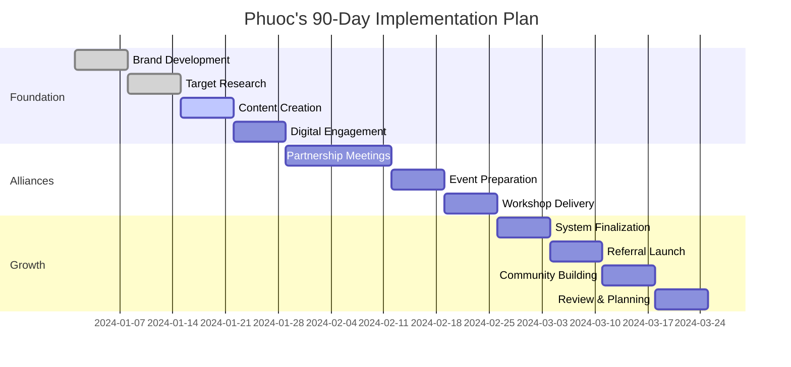

# The Premium Expat Strategy

## Marketing & Sales Blueprint for Personal Training Success in HCMC

**Phuoc's Path to Premium Personal Training**

---

## Executive Summary

Transform from a **commoditized personal trainer** to a **specialized Expat Wellness Strategist**

- Target: Professional expats in HCMC
- Focus: Districts 2 & 7 (Thao Dien & Phu My Hung)
- Strategy: No-ads approach using alliances & community engagement
- Goal: Premium pricing through specialized positioning

---

## The Challenge

{}
💸 **Saturated fitness market** - Commercial gyms, boutique studios everywhere
{}

{}
📉 **Price competition** - Generic trainers competing on cost
{}

{}
🎯 **Undifferentiated services** - Standard fitness approach doesn't address expat needs
{}

{}
💡 **The Opportunity**: Expat professionals have unique challenges requiring specialized solutions
{}

---

## Part 1: Foundation
### Positioning as the Go-To Wellness Strategist

---

## The Expat Challenge

Professional expats in HCMC face unique stressors:

- **New culinary landscape** navigation
- **High corporate pressure** in foreign environment  
- **Urban air pollution** health impacts
- **Mental load** of living/working abroad

---

## Additional Expat Stressors

- **Sedentary lifestyle** from desk work
- **Social isolation** in new environment
- **Healthcare system** navigation challenges
- **Work-life balance** in demanding roles

{}
**Standard fitness messages don't address these deeper concerns**
{}

---

## Your Unique Value Proposition

Move from **"Personal Trainer"** to **"Expat Wellness Strategist"**

{}
*"A holistic wellness program for HCMC's expat professionals, focused on building resilience, managing energy levels, and achieving sustainable health goals in a demanding new environment."*
{}

---

## Brand Story: Professional Identity

- Authentic personality + professional demeanor
- Relevant certifications (adult fitness, functional strength, nutrition)
- Clear specialization in expat wellness
- Professional headshot and well-written biography

---

## Brand Story: Consistent Messaging

Key terms to incorporate:
- **"Holistic wellness"** • **"Sustainable results"**
- **"Stress mitigation"** • **"Energy optimization"**
- **"Performance longevity"** • **"Lifestyle integration"**

Move beyond simple fitness terms to sophisticated language

---

## Brand Story: Demonstrated Authority

- Share valuable content addressing expat-specific problems
- Live the brand authentically
- Create helpful resources for community
- Establish credibility through knowledge sharing

---

## Part 2: The Hyper-Local Blueprint
### Multi-Layered Client Discovery

---

## Geographic Epicenters

Focus on **"Expat Bubbles"** - Districts 2 & 7

### District 2 (Thao Dien)
- International schools hub
- Western-style cafes & markets
- Luxury residential complexes

### District 7 (Phu My Hung)  
- Affluent expat families
- Premium retail & dining
- International business center

{}
**Strategy**: Become a known, trusted presence in these concentrated communities
{}

---

## Key Locations: International Schools

- **ISHCMC, BIS, AIS, EIS**
- **Target Time**: Morning drop-off & afternoon pick-up
- **Audience**: Busy expat parents
- **Strategy**: Build relationships through repeated presence

---

## Key Locations: Premium Retail & Cafes

- **Western delis** and organic markets
- **Specialty coffee shops** in Thao Dien
- **Strategy**: Become a regular customer
- **Goal**: Build organic conversations with health-conscious expats

---

## Key Locations: High-End Residential

- **The Masteri, Saigon Pearl, The Manor**
- **Population**: Luxury apartment residents
- **Opportunity**: Partner with building fitness facilities
- **Approach**: Connect with building management

---

## Digital Strategy: Tier 1 Groups

**Broad Community Groups (Passive Building)**

- **"Expats in Ho Chi Minh City"** (165k+ members)
- **Role**: Community Health Expert
- **Strategy**: Answer questions, provide value, NO selling
- **Goal**: Build authority and name recognition over time

---

## Digital Strategy: Tier 2 Groups

**Niche Community Groups (Active Value)**

- **"Fexpats - female expats and locals"**
- **"Saigon International Families"**  
- **Strategy**: Offer free webinars, host Q&A sessions
- **Approach**: More proactive engagement after establishing presence

---

## Digital Strategy: Tier 3 Platforms

**Professional & Social Networks**

- **InterNations**: Fellow Professional specializing in executive wellness
- **Meetup**: Peer in running/hiking groups with injury prevention expertise
- **Goal**: Peer-to-peer networking where business arises organically
- **Persona**: "Fellow Professional" not "Service Provider"

---

## Part 3: The Alliance Strategy
### Building a Referral Ecosystem

---

## The 'School Gate' Alliance

**Target**: High-income, time-poor parents at international schools

**Why This Works**:
- High concentration of target demographic
- Parents prioritize children over own health
- Need convenient, professional wellness solutions
- Strong community networks for referrals

---

## School Gate: Implementation Strategy

**4-Step Approach**:

1. **Research**: Identify PTAs at top schools (ISHCMC, BIS, AIS)
2. **Develop Offer**: Free workshop for busy parents
3. **Workshop Topics**: Energy & stress management for families
4. **Execute**: Deliver value, offer complimentary consultations

---

## School Gate: Workshop Examples

**High-Value Workshop Titles**:

- **"The 30-Minute Energy Boost: A Survival Guide for Busy Parents"**
- **"Stress-Proof Your Life: Simple Wellness Strategies for Expat Families"**
- **"Modeling Healthy Habits: A Parent's Guide to Fitness"**
- **"Family Wellness in HCMC: Practical Solutions for Expat Parents"**

---

## Corporate Wellness Partnerships

**Target**: MNCs with expat employees
- **Unilever, Nestlé, Intel, Samsung, Bosch**
- **Focus**: 45-60 minute "Lunch & Learn" format
- **Goal**: Boost productivity, improve morale, increase retention
- **Outcome**: Direct access to target demographic pool

---

## Corporate: Lunch & Learn Topics

**Workplace-Relevant Workshop Titles**:

- **"Beat the 3 PM Slump: Nutrition and Movement for Desk Workers"**
- **"The Executive Athlete: Managing Stress and Energy for Peak Performance"**
- **"Ergonomics for the Modern Office: Preventing Pain and Injury"**
- **"Desk Warrior Wellness: Combat Corporate Fatigue"**

---

## Corporate: Access Strategy

**Getting in the Door**:

- **Target HR Managers** via LinkedIn
- **Leverage AmCham membership** for credibility
- **Host free wellness webinars** for chamber members
- **Position as expertise sharing**, not sales pitch

---

## Allied Health Professional Network

**Principle**: Trust transference from established practitioners

**Why This Works**:
- Client health journeys involve multiple professionals
- Referral from trusted practitioner = qualified endorsement
- Pre-established trust shortens sales cycle
- Creates most powerful referral engine possible

---

## Allied Health: Target Partners

**Premium Healthcare Professionals**:

- **English-speaking physiotherapists**
- **Western-trained chiropractors**
- **Registered dietitians**
- **Premium wellness centers** (e.g., Mandala Wellness)

---

## Allied Health: Value Proposition

**Peer-to-Peer Professional Collaboration**:

*"I specialize in strength and conditioning for professional expats. Let's create a trusted network where we can confidently refer clients to each other for complementary services."*

**Not a favor request** - **A professional partnership**

---

## Part 4: Offer Architecture
### Designing High-Commitment Packages

---

## Package Structure Philosophy

**Shift from**: Sessions → **Transformations**

- Secure revenue upfront
- Foster greater client commitment  
- Provide duration for meaningful results
- Professional consultation vs. price quotation

---

## Three-Tier Package System

| | Foundation | Transformation | Executive Wellness |
|---|---|---|---|
| **Duration** | 3 months | 6 months | 12 months |
| **Sessions** | 2/week (24 total) | 2-3/week (48-72) | 3/week (144 total) |
| **Ideal For** | Building habits | Significant change | Year-round partner |
| **Investment** | Base rate | Commitment discount | Premium retainer |

---

## Value-Added: Digital Support

**Technology Integration**:

- **Professional training app** (Trainerize, PT Distinction)
- **WhatsApp support channel** for quick questions
- **Progress tracking & accountability** systems
- **Shared program access** for independent workouts

---

## Value-Added: Client Community

**Exclusive Peer Network**:

- **Private Facebook/WhatsApp group** for all package clients
- **Peer support network** among like-minded professionals
- **Exclusive content sharing** platform
- **Community challenges** and success celebrations

---

## Value-Added: Expat-Specific Resources

**Specialized Local Knowledge**:

- **"Healthiest Street Food Choices in District 2"**
- **"Travel Fitness Cheatsheet"** for Asia business trips
- **Local organic produce supplier** recommendations
- **HCMC gym access guide** for when traveling

---

## Part 5: The Flywheel
### Retention, Referrals & Exponential Growth

---

## The Expat Referral Engine

### "Share the Health" Partner Program

**For New Clients**:
- Complimentary initial consultation
- First TWO sessions free with 3+ month package

**For Existing Clients**:  
- Two free sessions credited to current package
- Or discount on next renewal

**Activation**: After new client completes first month + payment

---

## Sales Funnel: Awareness (TOFU)

**Top of Funnel - First Contact**:

- **Corporate "Lunch & Learn" workshops**
- **School PTA presentations**
- **Helpful Facebook group answers**
- **Business chamber networking mentions**

**Goal**: Generate initial awareness & establish credibility

---

## Sales Funnel: Consideration (MOFU)

**Middle of Funnel - Building Interest**:

- **LinkedIn/Instagram valuable content**
- **Social event conversations**
- **Client testimonial sharing**
- **Professional page following & engagement**

**Goal**: Nurture relationship, build trust, demonstrate expertise

---

## Sales Funnel: Conversion (BOFU)

**Bottom of Funnel - Decision Making**:

- **Direct referrals with program offer**
- **Professional website/profile visits**
- **Complimentary consultation booking**
- **Package selection & commitment**

**Goal**: Convert qualified leads into long-term, high-value clients

---

## Part 6: The 90-Day Action Plan
### From Strategy to Execution

---

## Month 1: Foundation & Outreach

**4-Week Implementation Plan**

---

## Week 1: Brand Solidification

- **Finalize UVP** as "Expat Wellness Strategist"
- **Write brand story** & professional bio
- **Update all digital profiles** with new messaging
- **Professional headshot** if needed

---

## Week 2: Target Identification

- **Research 10 allied health partners** (Districts 2 & 7)
- **Identify 3-5 target international schools**
- **Identify 3-5 target MNCs** in HCMC
- **Create contact database** with key information

---

## Week 3: Content Development

- **Draft outreach email templates**
- **Create "Lunch & Learn" proposals**
- **Begin allied health professional outreach**
- **Develop workshop presentation materials**

---

## Week 4: Digital Engagement

- **Join target Facebook groups**
- **Create/update InterNations profile**
- **Begin daily 15-20 minute** helpful engagement
- **Start building online presence** in communities

---

## Month 2: Building Alliances

**Convert Outreach into Relationships**

---

## Weeks 5-6: Partnership Development

- **Coffee meetings** with allied health professionals
- **Follow up** with school/corporate contacts
- **Attend networking events** (AmCham/InterNations)
- **Build personal connections** for future referrals

---

## Week 7: Event Preparation

- **Secure first workshop date**
- **Collaborate on promotion** with partner organization
- **Prepare presentation materials**
- **Finalize logistics** and attendee management

---

## Week 8: Delivery & Nurturing

- **Execute flawless workshop**
- **Collect opt-in contact information**
- **Send thank-you emails** within 24 hours
- **Begin warm lead nurturing** process

---

## Month 3: Launching the Flywheel

**Activate Growth Systems**

---

## Week 9: Finalize Systems

- **Complete tiered package details**
- **Structure "Share the Health" referral program**
- **Create referral marketing materials**
- **Set up tracking systems**

---

## Week 10: Activate Referrals

- **Introduce program to existing clients**
- **Explain dual-sided benefits**
- **Provide sharing materials**
- **Launch referral tracking system**

---

## Week 11: Foster Community

- **Create private client community group**
- **Post welcome message & set tone**
- **Begin weekly exclusive content**
- **Encourage peer interactions**

---

## Week 12: Review & Refine

- **Conduct 90-day strategic review**
- **Analyze most effective channels**
- **Plan next workshop**
- **Refine strategy for next cycle**

---

## Success Metrics: Month 1

**Foundation Benchmarks**:

- ✅ **10 allied health professional contacts** made
- ✅ **1 workshop scheduled** with school/corporate partner
- ✅ **Active in 3+ Facebook groups** with helpful contributions
- ✅ **Digital profiles updated** with expat wellness positioning

---

## Success Metrics: Month 2

**Alliance Building Benchmarks**:

- ✅ **3+ partnership agreements** signed
- ✅ **1 successful workshop delivered** with positive feedback
- ✅ **10+ warm leads** in pipeline
- ✅ **Active networking presence** in business chambers

---

## Success Metrics: Month 3

**Growth System Benchmarks**:

- ✅ **Referral program launched** to existing clients
- ✅ **Client community active** with regular engagement
- ✅ **Next workshop scheduled** for following month
- ✅ **2+ new package clients signed** from lead generation

---

## Implementation Timeline

---

## The Transformation: From

**Current State**:

- **Generic personal trainer**
- **Competing on price**
- **Session-by-session sales**
- **Ad-dependent marketing**

---

## The Transformation: To

**Target State**:

- **Specialized Expat Wellness Strategist**
- **Premium positioning**
- **Transformation-based packages**
- **Alliance-driven growth**

---

## Immediate Next Steps

**Start This Week**:

1. **Finalize your UVP** and update all profiles
2. **Begin research** on Districts 2 & 7 locations
3. **Create target contact list** for outreach
4. **Update LinkedIn/social profiles** with new positioning

---

## Short-Term Action Items

**Next 30 Days**:

- **Make first 5 allied health professional contacts**
- **Identify and contact 3 international school PTAs**
- **Join 3+ relevant Facebook groups**
- **Attend 1 networking event** (AmCham/InterNations)

---

## 90-Day Success Vision

**Complete Strategy Implementation**:

- **Referral program active** with existing clients
- **Workshop delivery system** operational
- **Professional alliance network** established
- **Premium package clients** signed and engaged

---

## Questions & Discussion

**Ready to transform your personal training business into a premium wellness partnership for HCMC's expat community?**

Let's discuss implementation details and answer any questions about the strategy.

---

## Contact & Resources

**Phuoc's Expat Wellness Strategy**
- Email: [your-email]
- LinkedIn: [your-profile]
- Target Areas: District 2 (Thao Dien) & District 7 (Phu My Hung)

*"Building resilience, managing energy, achieving sustainable health goals in HCMC's demanding expat environment"* 